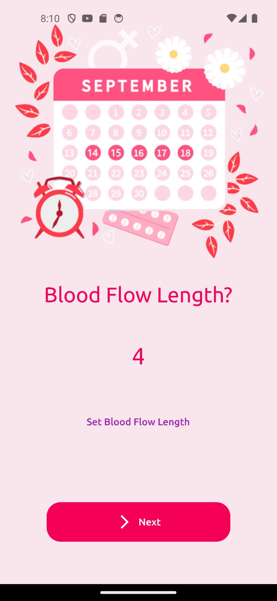
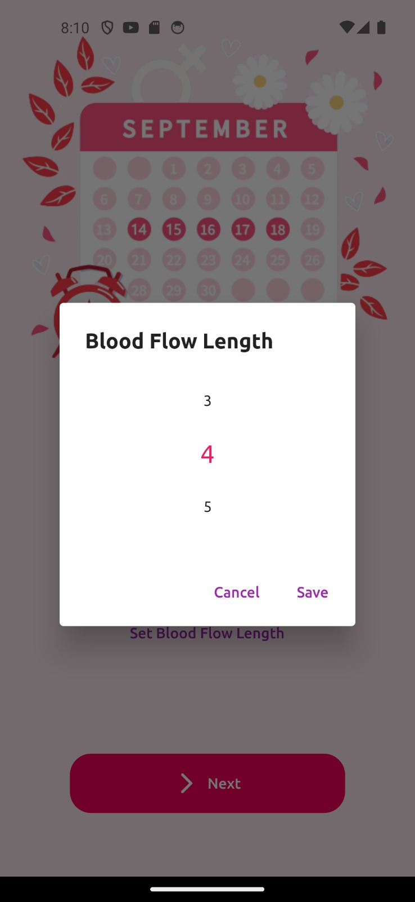
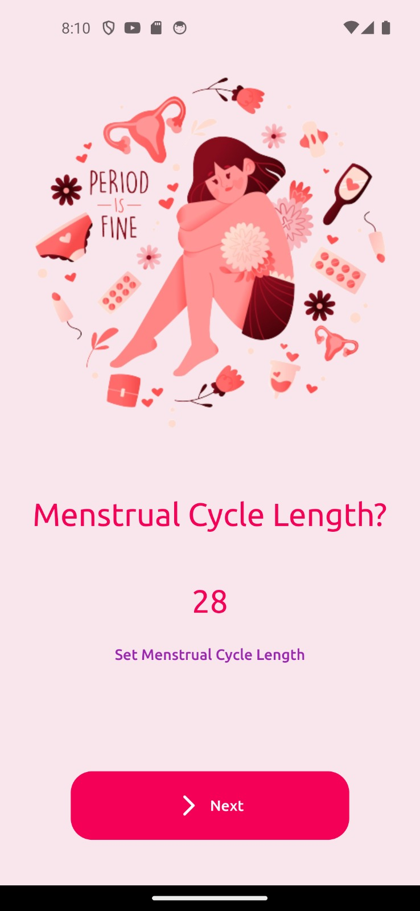
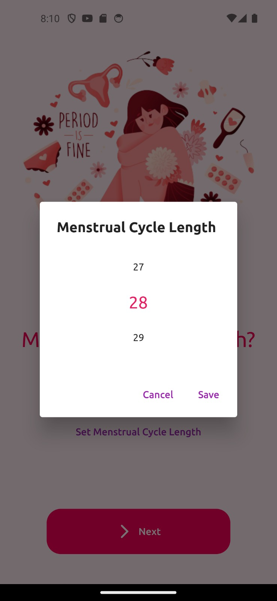
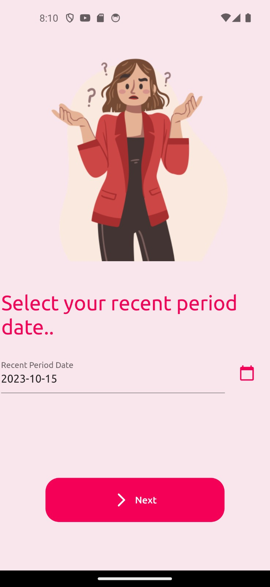
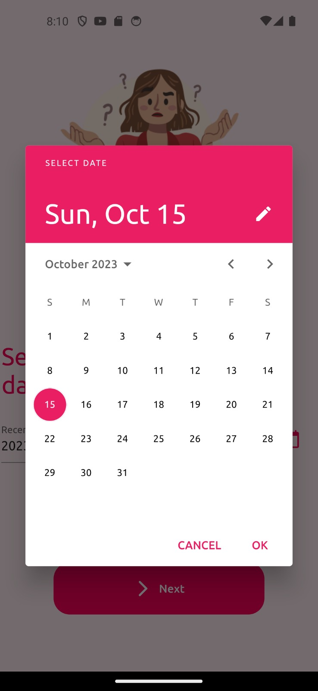

# 
Stritva - Celebrating Womenhood🥳

Stritiva is your ultimate menstrual health companion, offering a seamless and intuitive mobile experience for tracking your menstrual cycle, providing valuable educational resources on menstruation, and enabling you to document your personal insights.

## ⚠️ Problem Statement
Stritiva addresses the pressing need for a user-friendly, all-in-one solution for tracking menstrual cycles, providing essential education about menstruation, and enabling personalized health management. Many individuals lack accessible, informative resources for managing their menstrual health effectively, which can lead to a lack of empowerment, awareness, and understanding.

## 😃 Inspiration & Motivation
Our motivation stems from the belief that everyone deserves to have control over their menstrual health and access to comprehensive information. Stritiva was created with a vision of providing individuals with a digital companion to empower them on their menstrual health journey.

## 📱 Features
Stritiva offers an array of essential features, including:

- Cycle Tracking: Easily monitor your menstrual cycle, including period length and cycle regularity.
- Educational Resources: Access a wealth of information on menstrual hygiene, color coding of menstrual blood, and dispelling common myths.
- Personal Notes: Keep a digital diary of your menstrual experiences, making it simple to reflect on your journey.

## 🤔 Features in Future
We are committed to further enhancing Stritiva with upcoming features, such as:

- Symptom Tracking: Record and monitor symptoms like cramps, mood changes, and headaches.
- Community Support: Connect with a community of individuals for shared experiences and support.

## ⚒️ Tools & Technology
Stritiva was developed using cutting-edge tools and technologies, including:

- Flutter (Mobile App Development)
- Figma (UI/UX Design)

## 🧑‍🤝‍🧑Contributors
Anish Adhikari
Abhishek kumar Ray

## 🤔How to Use the App
The step by step guide to use the App is shown below:

### These are the welcome pages
 

 Finally,

 ## Homepage
The Stritiva Homepage offers users a comprehensive overview of essential information. It prominently displays the local time and date, along with key details related to your menstrual cycle, such as cycle length and period duration. This feature provides a quick and convenient way to stay informed about your menstrual health.

## Profile Page
The Profile Page offers a centralized hub for users to manage their personal details and access detailed reports about their menstrual cycles. It serves as a dynamic repository of critical information. Additionally, users can configure their profiles and data via the Settings, ensuring that the app adapts to their evolving needs and preferences.

## Calendar Section
Within the Calendar Section, users can access a visual representation of their menstrual cycle, highlighting the specific days of menstruation for the current month. This valuable tool empowers users to plan various activities, including vacations, hikes, and physically intensive endeavors, with greater precision and confidence.

## Add Notes
The Add Notes feature enables users to record important details and personal notes for specific dates on the calendar. This functionality serves as a valuable digital diary, allowing users to document noteworthy events, thoughts, or experiences. These entries can be later revisited, fostering self-reflection and insights over time.

## Choose Emotions
Users have the ability to select and document their emotional state from a range of options, including Happy, Sad, Angry, Love, and Good. This feature provides a nuanced perspective on how emotions may fluctuate throughout the menstrual cycle, allowing for a deeper understanding of one's emotional well-being.

## Info Page
The Info Page is a dedicated section where users can access informative guides related to menstrual hygiene, including detailed guidance on using pads and menstrual cloths. Moreover, when users click on each section, they can delve into comprehensive information that allows them to gain an in-depth understanding of the content.

Additionally, this section provides insights into the color code associated with menstrual blood, helping users differentiate and interpret the various hues they may encounter during their menstrual cycle. By demystifying common myths and delivering factual information, the Info Page empowers users with a rich source of knowledge, enabling them to make informed decisions about their menstrual health and hygiene.

# Stritva for Celebrating Womenhood
